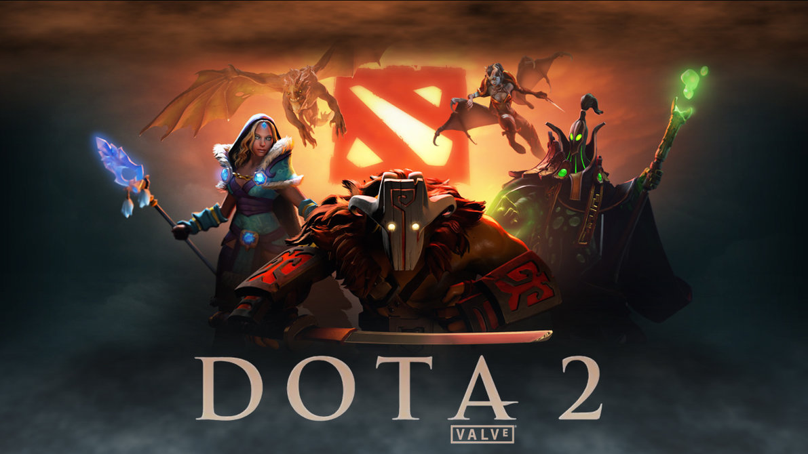
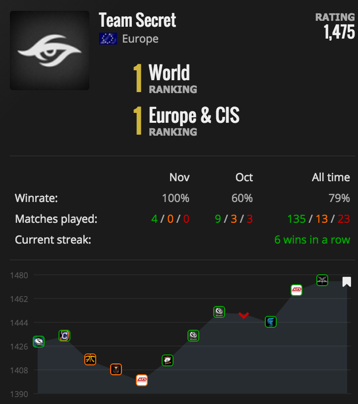
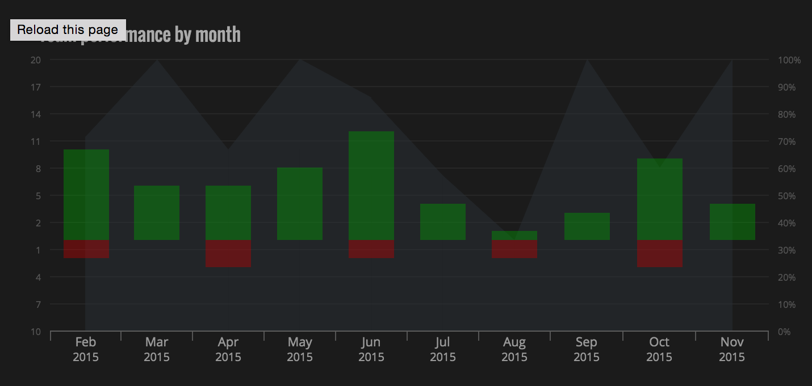
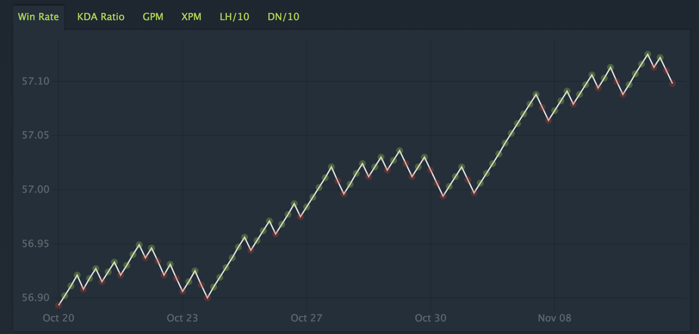
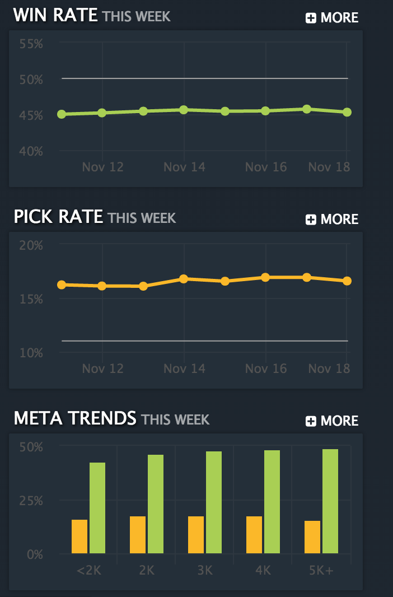
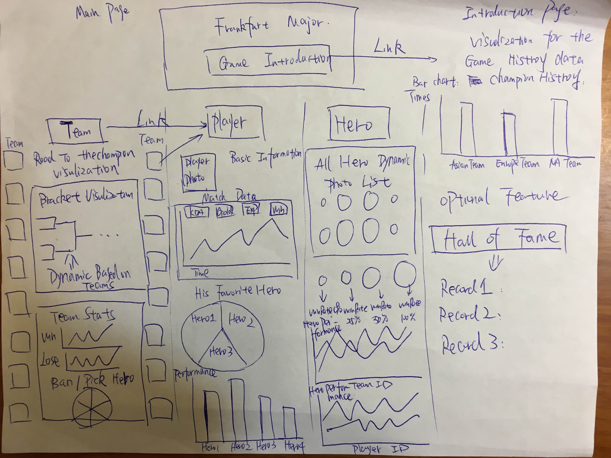

Final Project: DOTA2 Visualization - The Frankfurt Major 2015 
===

Team Member and Related Link
---
######Lin Du, ldu@wpi.edu, LinsanityDu  
######Zhongyuan Fu, zyfu0408@gmail.com, zyfu0408
######Jifeng Kou,jkou@wpi.edu,JifengKou

[Github Repo Link](https://github.com/datavisfordota2/datavisfordota2.github.io)

[Visualization Link (under construction)](http://datavisfordota2.github.io/)

Process Book

An important part of your project is your process book. Your process book details your steps in developing your solution, including the alternative designs you tried, and the insights you got. Develop your process book out of the project proposal. Equally important to your final results is how you got there! Your process book is the place you describe and document the space of possibilities you explored at each step of your project. It is not, however, a journal or lab notebook that describes every detail - you should think carefully about the important decisions you made and insights you gained and present your reasoning in a concise way.

We strongly advise you to include many figures in your process book, including photos of your sketches of potential designs, screen shots from different visualization tools you explored, inspirations of visualizations you found online, etc. Several images illustrating changes in your design or focus over time will be far more informative than text describing those changes. Instead, use text to describe the rationale behind the evolution of your project.

Your process book should include the following topics. Depending on your project type the amount of discussion you devote to each of them will vary:

Overview and Motivation: Provide an overview of the project goals and the motivation for it. Consider that this will be read by people who did not see your project proposal.
Related Work: Anything that inspired you, such as a paper, a web site, visualizations we discussed in class, etc.
Questions: What questions are you trying to answer? How did these questions evolve over the course of the project? What new questions did you consider in the course of your analysis?
Data: Source, scraping method, cleanup, etc.
Exploratory Data Analysis: What visualizations did you use to initially look at your data? What insights did you gain? How did these insights inform your design?
Design Evolution: What are the different visualizations you considered? Justify the design decisions you made using the perceptual and design principles you learned in the course. Did you deviate from your proposal?
Implementation: Describe the intent and functionality of the interactive visualizations you implemented. Provide clear and well-referenced images showing the key design and interaction elements.
Evaluation: What did you learn about the data by using your visualizations? How did you answer your questions? How well does your visualization work, and how could you further improve it?
As this will be your only chance to describe your project in detail make sure that your process book is a standalone document that fully describes your results and the final design. Here are a few examples of process books from a similar course final.

Overview and Motivation
---

####
Fig1. Dota2 poster by Valve

Based on [Wikipedia](https://en.wikipedia.org/wiki/Dota_2), "**Dota2** is a multiplayer online battle arena viedo game. Dota 2 is played in matches involving two teams of five players, each of which occupies a stronghold at a corner of the map. Each stronghold contains a building called the "Ancient", which the opposite team must destroy to win the match. Each player controls a character called a "Hero", and focuses on leveling up, collecting gold, acquiring items, and fighting against the other team to achieve victory."

**Dota2** is not a simple game, actually, it is a sport which is the same as Football, basketball and baseball. To be a professional **Dota2** player, one should have the outstanding teamwork, smart strategy and fast reaction. Think about it, there are around 1 Million dota2 players in the world, only 90 players can stand on the best tournament. How did this happen? What special abilities do these 90 players have? Could we become one of them? That is very interesting to investigate.

Which tournament should we focus? Since there are many dota2 tournament every month. **Of course**, we want to see the most recent tournament! Actually, it is still undergoing! we choose the [**2015 Frankfurt major (Nov.16th - Nov. 21st)**](http://www.thefrankfurtmajor.com/). The Frankfurt Major (or "Fall Major") will be the first event of Valve's Dota Major Championships, which will add 3 new publisher-sponsored tournaments each year in addition to The International. The Main Event will take place at Festhalle Messe, a multi-purpose concert hall in Frankfurt, Germany with a total seating capacity of over 9,800. The prize pool of the tournament provided by Valve was set to **$3,000,000 USD**.

Project Objectives
---
In terms of the objectives, first of all, we are true **dota2** fans. We played the game, we watched the game and we enjoyed the game. We want to see our favorite players statistics in this tournament like what we see in the NFL and NBA website. Secondly, I have never seen a visualization that can describe the whole information in a **dota2** tournament, especially for this undergoing tournament. Last but not the least, we would like to show **dota2** is not a easy game, it is actually involving a lot of interesting stories. The most important thing we learn during this class is that the core of data visulization is to tell the story inside the data.

Data and Data Processing
---
Since our investigated tournament is still undergoing, we cannot not get the data right now. It is very possible that we need to organize the tournament data, such as the statistics of each match, each player and each team, by ourselves. This data collection may take some time, but I think it deserves. 

For the data formating, we are planning to collect the statistics of each match and format them is the following CSV style:

In this data format, the column of "TeamID" and "PlayerID" are the primary key in these data. The remaining columns, such as "Hero", "Assists", "Kills" and "Death", can describe the performance of each player in this match. Based on these data, we can calculate a lot of useful information, an important one of them is "KDA", which is "(Kills + Assists) / Deaths" and can descirbe the general performance of one player in this match. We will investigate more features that can evaluate the power ranking of the teams, players and heroes in this tounament.

#####Data references: 

[ESL Website](http://www.thefrankfurtmajor.com/)

[dota2 Official Website](http://blog.dota2.com/)

[dotabuff](http://www.dotabuff.com/)

Visualization Design
---

The main component of this visualization is that how we choose the focus of this tournament. We can focus on the team statistics, the player statistics and the hero statistics. Therefore we have the following design prototypes:

Design1: Team focus design.

Since the tournament consists of 16 teams, we want to show each team's statistics to visualize this tournament information. We want to use the trending line chart to show the team performance; also we would like to use the error bar chart to show each team and its opponent infomation.

 

Design2: Player focus design.

Since each player has different role in his team, we want to see each player's importance in his team. We would like to use trending line to see each player's different statistics, such as his earned gold and his KDA in each match. Also we want to use a pie chart to see each player's favourite hero in this tournament. 

Design3: Hero focus design

Hero-based design can let us see more about the insight of this tournament. We want to see which hero is overpowered and which hero is the most popular. We can use the trending line chart and bar chart to see the pick rate, ban rate, win rate and earned gold in this tournament. We can also think about more parameters to evaluate the hero power ranking in this major.

Final Design:

Since all of these three components are very important, finally we decide to combine these three major components as below.

From the team side: We can visualize each team information. From each team information, we can see each player's general information, which means we can change the visualization from team side to the player side.

From the player side: We can visulize each player information like above, such as his favourite heroes. Therefore, we can link the player's visulization to the heroes' visulization.

From the hero side: Like what we described above, the heroes visulization is the core of this whole visulizaion, since we can change to the hero visulization from both team side and player side. 

In conclusion, we want to divide this whole visualization into three parts: Team, Player and Hero.

Must-have Features
---
For the team component:

1. The visualization of each team's statistics, such as pick/ban favorite heroes and team win/loss rate.
2. The "Road-to-the-champion" visualization of each team. 

For the player component:

1. The visualization of every player's statistics, such as KDA per game, earned gold per game etc.
2. The visualization of the rank of every player based on different criteria.

For the hero component:

1. The visulization of every hero's statistics, such as pick/ban rate, gold per min, experinece per min, best versus and worst versus etc.
2. The visualization of the rank of every hero based on different criteria.

Optional Features
---
We are considering to add another feature like "Hall of Fame" in this tournament. In this feature, we want to visulize the record of teams, players and heroes in this brilliant tournament.

Project Schedule
---
Nov 17th - Nov 21st   Writing the proposal and gathering the data

Nov 22nd - Nov 28th	   Writing the framework of the whole visulization.

Nov 29th - Dec 10th   Developing the must-have features of team component, player component and hero component.

Dec 11th - Dec 15th   Developing optional features and making final changes.
